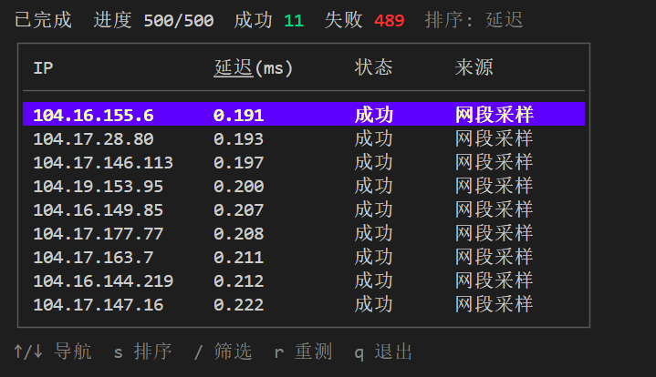

# CFip优选ip go版本


## 有关项目
## 如何使用

新建 ip.txt，逐行写入ip，支持cidr格式以及限定采样数

```
1.1.1.1
1.1.1.1/13
1.1.1.1/13=500
```


```go
go run .
```

运行后可在日志看到优选ip列表

## TUI 使用

实时可视化测速进度与结果表格：

```bash
go run ./cmd/tui
```

按键：`↑/↓` 导航，`s` 切换排序（延迟/IP/状态），`/` 筛选 IP 子串，`r` 重新测速，`q` 退出。

## 桌面应用（GUI）

基于 Wails v3 + Vue 3 的跨平台桌面端，位于 `cmd/app`：

```bash
cd cmd/app
wails3 dev          # 开发模式（热重载）
wails3 task build   # 生产构建
```

功能：

- **IP 来源**：导入 `ip.txt`、加载内置 Cloudflare 官方网段（在线拉取，失败自动回退内置列表），或直接编辑
- **流式测速**：结果逐条实时刷新，支持按延迟 / IP / 状态排序，按 IP 筛选
- **机房白名单**：按 `cf-ray` 的 IATA 代码过滤（如 `HKG NRT SIN`），内置东亚推荐机房可一键填入
- **参数配置**：延迟上限、并发数、请求超时、达标数量、机房白名单，支持保存与取消
- **测速日志**：每次测速结束自动写入 `speed-latest.txt`（覆盖上一次，不会堆积），可手动导出或打开日志目录

配置文件与日志目录：

| 平台 | 路径 |
|---|---|
| Windows | `%AppData%\cfip-go\` |
| macOS | `~/Library/Application Support/cfip-go/` |
| Linux | `~/.config/cfip-go/` |

`config.yaml` 对应字段：

```yaml
latency: 500       # 延迟上限（ms），超过算「超标」
concurrency: 16    # 并发数
timeout: 500       # 单个 IP 探测超时（ms）
number: 20         # 凑够多少个达标 IP 即停止
colo: ""           # 机房白名单，空格分隔；留空不过滤
```

## 效果图

[](png/image.png)
